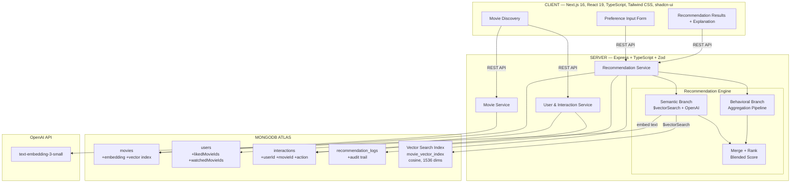
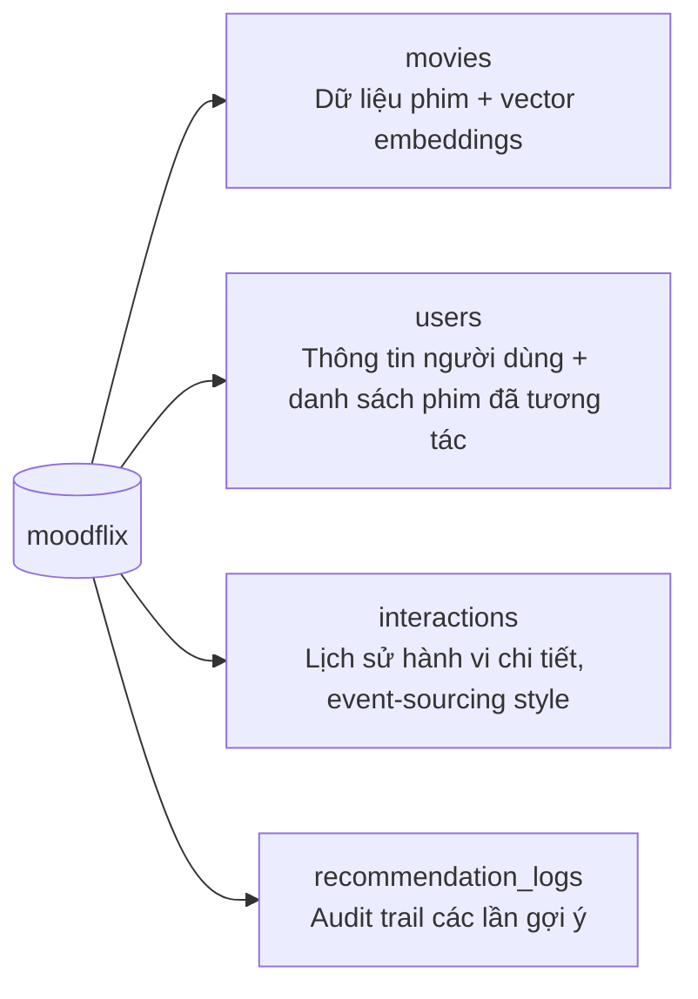
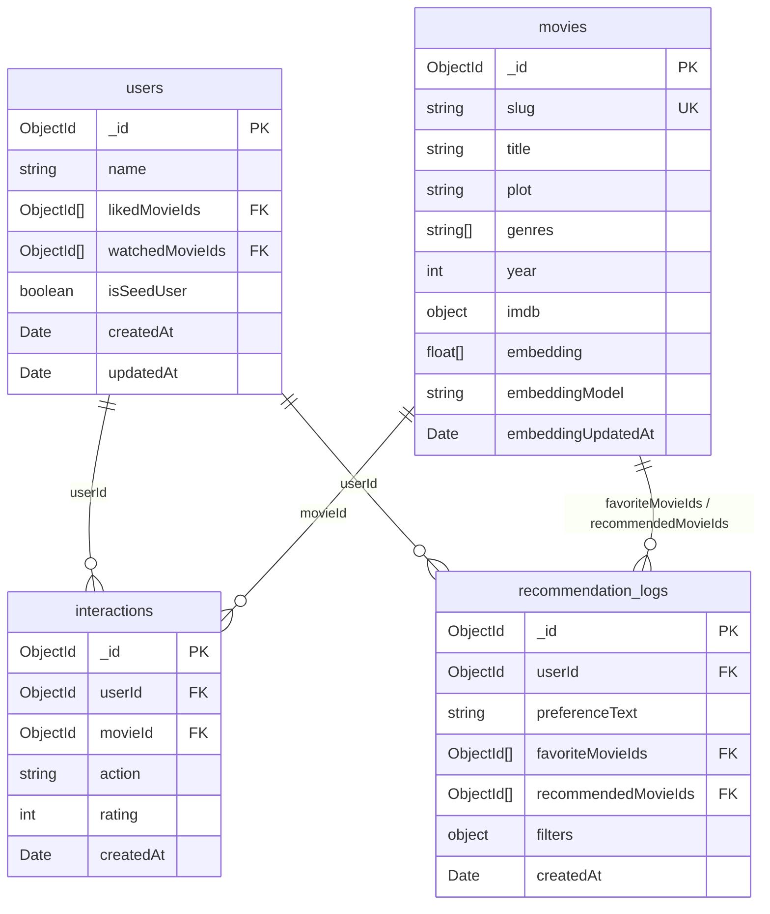
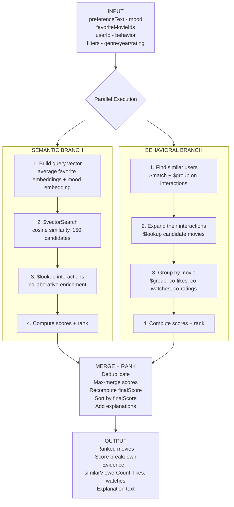

# MoodFlix — Tài Liệu Kỹ Thuật

## MUGVN × MongoDB Mini Hackathon 2026

**Đội:** 100M Builder  
**Thành viên:** Hoàng Trọng Trà  
**Dự án:** MoodFlix — Movie Recommendation Engine  
**Use case:** Gợi ý phim dựa trên tâm trạng, sở thích cá nhân và hành vi người dùng tương tự

---

## Mục Lục

1. [MVP và Kiến Trúc Hệ Thống Tổng Thể](#1-mvp-và-kiến-trúc-hệ-thống-tổng-thể)
2. [Data Schema và Kiến Trúc Dữ Liệu MongoDB](#2-data-schema-và-kiến-trúc-dữ-liệu-mongodb)
3. [Mô Tả Cách Áp Dụng Vector Search và Aggregation Pipeline](#3-mô-tả-cách-áp-dụng-vector-search-và-aggregation-pipeline)

---

## 1. MVP và Kiến Trúc Hệ Thống Tổng Thể

### 1.1 Tổng Quan MVP

MoodFlix là một Recommendation Engine gợi ý phim dựa trên:
- **Ngữ nghĩa (Semantic):** Người dùng mô tả tâm trạng hoặc sở thích bằng ngôn ngữ tự nhiên
- **Hành vi (Behavioral):** Hệ thống phân tích hành vi like/watch/rate/skip để tìm người dùng tương tự
- **Kết hợp (Blended):** Merge kết quả từ cả 2 nhánh, xếp hạng bằng weighted scoring model

### 1.2 Tính Năng Chính

| Tính năng | Mô tả |
|---|---|
| Mood-based search | Nhập mô tả tâm trạng → Vector Search tìm phim phù hợp ngữ nghĩa |
| Favorite-based recommendation | Chọn phim yêu thích → tìm phim tương tự qua embedding similarity |
| Collaborative filtering | Phân tích hành vi người dùng tương tự qua Aggregation Pipeline |
| User behavior tracking | Ghi nhận liked, watched, skipped, rated interactions |
| Explainable results | Mỗi kết quả có score breakdown và giải thích lý do gợi ý |
| Filter & discovery | Lọc theo genre, năm, rating; tìm kiếm phim |
| System readiness | Dashboard kiểm tra trạng thái DB, embeddings, vector index |

### 1.3 Kiến Trúc Hệ Thống



### 1.4 Technology Stack

| Layer | Công nghệ | Vai trò |
|---|---|---|
| Frontend | Next.js 16, React 19, TypeScript | Dashboard tương tác |
| UI | Tailwind CSS, shadcn/ui | Component library |
| Backend | Express.js, TypeScript, Zod | REST API, validation |
| Database | MongoDB Atlas | Primary database |
| AI/ML | OpenAI text-embedding-3-small | Text → Vector embedding |
| Vector Search | MongoDB Atlas Vector Search | Semantic similarity |
| Collaborative | MongoDB Aggregation Pipeline | Behavioral filtering |

### 1.5 API Endpoints

| Method | Path | Mục đích |
|---|---|---|
| `GET` | `/health` | Health check |
| `GET` | `/api/system/readiness` | Kiểm tra dataset, embedding, index |
| `GET` | `/api/movies` | Danh sách phim (paginated, filterable) |
| `GET` | `/api/movies/search` | Tìm kiếm phim |
| `GET` | `/api/movies/meta` | Metadata (genres, years, ratings) |
| `GET` | `/api/movies/:movieId` | Chi tiết phim |
| `POST` | `/api/users/demo` | Tạo demo user |
| `POST` | `/api/interactions` | Ghi nhận hành vi (like/watch/skip/rate) |
| `POST` | `/api/recommendations` | **Generate recommendations** |
| `GET` | `/api/recommendations/:userId/history` | Lịch sử gợi ý |
| `GET` | `/api/embeddings/config` | Cấu hình embedding |
| `POST` | `/api/embeddings/preview` | Preview embedding |

---

## 2. Data Schema và Kiến Trúc Dữ Liệu MongoDB

### 2.1 Tổng Quan Collections

MoodFlix sử dụng **4 collections** trong database `moodflix`:



### 2.2 Collection: `movies`

Lưu trữ thông tin phim và vector embedding cho similarity search.

```javascript
{
  _id: ObjectId("..."),
  slug: "arrival-2016",                    // Unique identifier
  title: "Arrival",
  plot: "A linguist works with the military...",
  fullplot: "...",                          // Mô tả chi tiết
  genres: ["Drama", "Sci-Fi"],
  year: 2016,
  runtime: 116,                            // Phút
  poster: "https://...",
  cast: ["Amy Adams", "Jeremy Renner", ...],
  directors: ["Denis Villeneuve"],
  imdb: {
    rating: 7.9,
    votes: 742000
  },
  tomatoes: {
    viewer: {
      rating: 4.1,
      numReviews: 95000
    }
  },

  // === VECTOR EMBEDDING ===
  embedding: [0.0123, -0.0456, 0.0789, ...],  // 1536 dimensions
  embeddingProvider: "openai",
  embeddingModel: "text-embedding-3-small",
  embeddingUpdatedAt: ISODate("2026-05-21T..."),

  createdAt: ISODate("2026-05-21T..."),
  updatedAt: ISODate("2026-05-21T...")
}
```

**Indexes:**
| Index | Type | Mục đích |
|---|---|---|
| `{ slug: 1 }` | Unique | Lookup nhanh theo slug |
| `{ title: "text", plot: "text", fullplot: "text" }` | Text | Full-text search |
| `{ genres: 1, year: -1, "imdb.rating": -1 }` | Compound | Filter + sort |
| `movie_vector_index` | **Vector Search** | Semantic similarity (cosine, 1536 dims) |

**Embedding Generation:**
Mỗi phim được chuyển thành text rồi embed:
```
Title: Arrival
Year: 2016
Genres: Drama, Sci-Fi
Directors: Denis Villeneuve
Cast: Amy Adams, Jeremy Renner, ...
Story: A linguist works with the military to communicate with alien lifeforms...
```

### 2.3 Collection: `users`

Lưu thông tin người dùng và danh sách phim đã tương tác tích cực.

```javascript
{
  _id: ObjectId("..."),
  name: "MoodFlix Demo User",
  likedMovieIds: [                         // Phim đã like hoặc rate cao
    ObjectId("..."),
    ObjectId("...")
  ],
  watchedMovieIds: [                       // Phim đã xem
    ObjectId("...")
  ],
  isSeedUser: false,                       // true cho demo seed users
  createdAt: ISODate("2026-05-21T..."),
  updatedAt: ISODate("2026-05-21T...")
}
```

**Vai trò trong Recommendation:**
- `likedMovieIds` → input cho Vector Search (lấy embedding trung bình)
- `likedMovieIds` → input cho Collaborative Filtering (tìm users có cùng likes)
- `watchedMovieIds` → loại trừ khỏi kết quả gợi ý (đã xem rồi)

### 2.4 Collection: `interactions`

Event-sourcing style — ghi nhận mọi hành vi người dùng.

```javascript
{
  _id: ObjectId("..."),
  userId: ObjectId("..."),                 // Ref → users._id
  movieId: ObjectId("..."),                // Ref → movies._id
  action: "liked",                         // "liked" | "watched" | "skipped" | "rated"
  rating: 9,                               // Optional, 0-10 (chỉ khi action = "rated")
  createdAt: ISODate("2026-05-21T...")
}
```

**Các loại action và ý nghĩa:**
| Action | Ý nghĩa | Dùng trong Collaborative Filtering |
|---|---|---|
| `liked` | Người dùng thích phim | ✅ Positive signal (weight cao nhất) |
| `rated` | Đánh giá điểm | ✅ Positive signal (weight 0.8) |
| `watched` | Đã xem | ✅ Positive signal (weight 0.45) |
| `skipped` | Bỏ qua | ❌ Không dùng cho collaborative |

**Vai trò trong Recommendation:**
- Là nguồn dữ liệu chính cho **Aggregation Pipeline collaborative filtering**
- Tìm "similar users" = users có cùng positive interactions trên cùng movies
- Mở rộng candidates = movies mà similar users cũng liked/rated/watched

### 2.5 Collection: `recommendation_logs`

Audit trail — lưu lại mỗi lần generate recommendations.

```javascript
{
  _id: ObjectId("..."),
  userId: ObjectId("..."),                 // Ai yêu cầu
  preferenceText: "emotional sci-fi about memory and family",
  favoriteMovieIds: [                      // Input movies
    ObjectId("..."),
    ObjectId("...")
  ],
  recommendedMovieIds: [                   // Output movies
    ObjectId("..."),
    ObjectId("..."),
    ObjectId("...")
  ],
  filters: {                               // Filters đã áp dụng
    genres: ["Sci-Fi"],
    minRating: 7
  },
  createdAt: ISODate("2026-05-21T...")
}
```

### 2.6 Quan Hệ Giữa Các Collections



### 2.7 Demo Seed Data

Hệ thống có 5 seed users với taste profiles khác nhau để collaborative filtering hoạt động ngay:

| Seed User | Taste Profile | Liked Movies |
|---|---|---|
| Emotional Sci-Fi | Phim sci-fi cảm xúc | Arrival, Her, Eternal Sunshine, Interstellar |
| Mind-Bending Sci-Fi | Phim sci-fi hack não | Inception, The Matrix, Blade Runner 2049 |
| Data And Ambition | Phim về dữ liệu/tham vọng | Moneyball, Social Network, Imitation Game |
| Warm Family Stories | Phim gia đình ấm áp | Coco, Inside Out, Up, Pursuit of Happyness |
| Stylish Mystery Drama | Phim bí ẩn phong cách | Parasite, Knives Out, Grand Budapest Hotel |

---

## 3. Mô Tả Cách Áp Dụng Vector Search và Aggregation Pipeline

### 3.1 Tổng Quan Recommendation Flow

Khi người dùng gọi `POST /api/recommendations`, engine chạy **2 nhánh song song**:



### 3.2 MongoDB Atlas Vector Search — Chi Tiết

#### 3.2.1 Vector Index Definition

```javascript
// Tạo bởi script: npm run db:create-vector-index
{
  name: "movie_vector_index",
  type: "vectorSearch",
  definition: {
    fields: [
      {
        type: "vector",
        path: "embedding",           // Field chứa vector
        numDimensions: 1536,         // OpenAI text-embedding-3-small
        similarity: "cosine"         // Cosine similarity
      },
      { type: "filter", path: "genres" },
      { type: "filter", path: "year" },
      { type: "filter", path: "imdb.rating" }
    ]
  }
}
```

#### 3.2.2 Query Vector Construction

Query vector được xây dựng từ nhiều nguồn:

```javascript
// 1. Lấy embeddings từ favorite movies
const favoriteMovieVectors = favoriteMovies
  .map(movie => movie.embedding)
  .filter(Boolean);

// 2. Embed preference text (mood description)
const preferenceTextVector = await openai.embeddings.create({
  model: "text-embedding-3-small",
  input: "emotional sci-fi about memory, family, and human connection"
});

// 3. Average tất cả vectors thành 1 query vector
const queryVector = averageVectors([
  ...favoriteMovieVectors,
  preferenceTextVector
]);
```

**Ý nghĩa:** Query vector đại diện cho "vùng ngữ nghĩa" mà người dùng quan tâm — kết hợp cả nội dung phim yêu thích lẫn mô tả tâm trạng.

#### 3.2.3 $vectorSearch Stage

```javascript
{
  $vectorSearch: {
    index: "movie_vector_index",
    path: "embedding",
    queryVector: queryVector,        // 1536-dim vector
    numCandidates: 150,              // Số candidates ANN xét
    limit: 32                        // Số kết quả trả về
  }
}
```

**Cách hoạt động:**
1. MongoDB Atlas sử dụng thuật toán ANN (Approximate Nearest Neighbor) 
2. Tìm 150 candidates gần nhất với queryVector trong không gian cosine
3. Trả về top 32 kết quả có cosine similarity cao nhất
4. Mỗi kết quả có `vectorSearchScore` (0→1) thể hiện mức độ tương đồng ngữ nghĩa

#### 3.2.4 Vai Trò Trong Scoring

Vector Search score chiếm **42%** trọng số trong final score:

```javascript
const scoringWeights = {
  vector: 0.42,          // ← Semantic similarity
  collaborative: 0.33,  // Behavioral matching
  rating: 0.12,         // IMDb rating
  genreOverlap: 0.08,   // Genre match
  popularity: 0.05      // Vote count
};
```

### 3.3 Aggregation Pipeline — Chi Tiết

Aggregation Pipeline được sử dụng ở **3 nơi chính**:

#### 3.3.1 Pipeline A: Semantic Branch (Vector Search + Collaborative Enrichment)

Pipeline này bắt đầu bằng `$vectorSearch` rồi enrich bằng collaborative data:

```javascript
[
  // Stage 1: Vector Search — tìm phim tương đồng ngữ nghĩa
  {
    $vectorSearch: {
      index: "movie_vector_index",
      path: "embedding",
      queryVector: queryVector,
      numCandidates: 150,
      limit: 32
    }
  },

  // Stage 2: Gắn vectorScore
  {
    $addFields: {
      vectorScore: { $meta: "vectorSearchScore" }
    }
  },

  // Stage 3: Filter (loại phim đã xem, áp dụng genre/year/rating filters)
  {
    $match: {
      _id: { $nin: excludedMovieIds },
      genres: { $in: ["Sci-Fi"] },
      "imdb.rating": { $gte: 7 }
    }
  },

  // Stage 4: Tính rating và popularity scores
  {
    $addFields: {
      ratingValue: { $ifNull: ["$imdb.rating", 0] },
      votesValue: { $ifNull: ["$imdb.votes", 0] },
      genreOverlapCount: {
        $size: {
          $setIntersection: [
            { $ifNull: ["$genres", []] },
            ["Drama", "Sci-Fi"]  // preferredGenres
          ]
        }
      }
    }
  },

  // Stage 5: $lookup — Collaborative enrichment
  // Tìm interactions của similar users trên candidate movies
  {
    $lookup: {
      from: "interactions",
      let: { candidateMovieId: "$_id" },
      pipeline: [
        {
          $match: {
            $expr: {
              $and: [
                { $eq: ["$movieId", "$$candidateMovieId"] },
                { $in: ["$userId", collaborativeUserIds] },
                { $in: ["$action", ["liked", "rated", "watched"]] }
              ]
            }
          }
        },
        {
          $group: {
            _id: "$movieId",
            count: { $sum: 1 },
            averageRating: { $avg: { $ifNull: ["$rating", 0] } }
          }
        }
      ],
      as: "collaborativeMatches"
    }
  },

  // Stage 6: Normalize scores
  {
    $addFields: {
      ratingScore: { $divide: [{ $min: [{ $max: ["$ratingValue", 0] }, 10] }, 10] },
      popularityScore: { $min: [1, { $divide: [{ $log10: { $add: ["$votesValue", 1] } }, 6] }] },
      genreOverlapScore: { $divide: ["$genreOverlapCount", 3] },
      collaborativeCount: { $ifNull: [{ $first: "$collaborativeMatches.count" }, 0] }
    }
  },

  // Stage 7: Collaborative score normalization
  {
    $addFields: {
      collaborativeScore: {
        $min: [1, { $divide: ["$collaborativeCount", collaborativeUserIds.length] }]
      }
    }
  },

  // Stage 8: Final weighted score
  {
    $addFields: {
      finalScore: {
        $add: [
          { $multiply: ["$vectorScore", 0.42] },
          { $multiply: ["$ratingScore", 0.12] },
          { $multiply: ["$genreOverlapScore", 0.08] },
          { $multiply: ["$popularityScore", 0.05] },
          { $multiply: ["$collaborativeScore", 0.33] }
        ]
      }
    }
  },

  // Stage 9: Sort by final score
  { $sort: { finalScore: -1, vectorScore: -1 } },

  // Stage 10: Limit results
  { $limit: 8 },

  // Stage 11: Remove embedding from output
  { $project: { embedding: 0, collaborativeMatches: 0 } }
]
```

#### 3.3.2 Pipeline B: Behavioral Branch (Pure Collaborative Filtering)

Pipeline này **không dùng Vector Search** — hoàn toàn dựa trên Aggregation Pipeline để tìm phim từ hành vi người dùng tương tự:

```javascript
[
  // Stage 1: Tìm interactions trên favorite movies (từ users khác)
  {
    $match: {
      movieId: { $in: favoriteMovieIds },
      action: { $in: ["liked", "rated", "watched"] },
      userId: { $ne: currentUserId }
    }
  },

  // Stage 2: Group by userId — tìm "similar users"
  // Users có nhiều overlap với favorites = similar hơn
  {
    $group: {
      _id: "$userId",
      overlapCount: { $sum: 1 },
      likedOverlap: {
        $sum: { $cond: [{ $eq: ["$action", "liked"] }, 1, 0] }
      }
    }
  },

  // Stage 3: Rank similar users
  { $sort: { overlapCount: -1, likedOverlap: -1 } },
  { $limit: 50 },  // Top 50 similar users

  // Stage 4: $lookup — Lấy TẤT CẢ interactions khác của similar users
  // (trừ movies đã có trong favorites/watched)
  {
    $lookup: {
      from: "interactions",
      let: { similarUserId: "$_id" },
      pipeline: [
        {
          $match: {
            $expr: {
              $and: [
                { $eq: ["$userId", "$$similarUserId"] },
                { $in: ["$action", ["liked", "rated", "watched"]] },
                { $not: [{ $in: ["$movieId", excludedMovieIds] }] }
              ]
            }
          }
        },
        { $project: { movieId: 1, action: 1, rating: 1 } }
      ],
      as: "candidateInteractions"
    }
  },

  // Stage 5: Unwind để xử lý từng interaction
  { $unwind: "$candidateInteractions" },

  // Stage 6: Group by movieId — đếm evidence từ similar users
  {
    $group: {
      _id: "$candidateInteractions.movieId",
      similarViewerIds: { $addToSet: "$_id" },
      overlapStrength: { $sum: "$overlapCount" },
      coLikeCount: {
        $sum: { $cond: [{ $eq: ["$candidateInteractions.action", "liked"] }, 1, 0] }
      },
      coWatchCount: {
        $sum: { $cond: [{ $eq: ["$candidateInteractions.action", "watched"] }, 1, 0] }
      },
      coRatingCount: {
        $sum: { $cond: [{ $eq: ["$candidateInteractions.action", "rated"] }, 1, 0] }
      },
      averageBehaviorRating: { $avg: "$candidateInteractions.rating" }
    }
  },

  // Stage 7: Tính collaborative score
  {
    $addFields: {
      similarViewerCount: { $size: "$similarViewerIds" },
      collaborativeScore: {
        $min: [1, {
          $divide: [
            {
              $add: [
                "$coLikeCount",                          // Like = 1.0x
                { $multiply: ["$coRatingCount", 0.8] }, // Rate = 0.8x
                { $multiply: ["$coWatchCount", 0.45] }, // Watch = 0.45x
                { $multiply: ["$overlapStrength", 0.2] }// Overlap bonus
              ]
            },
            favoriteMovieIds.length * 3  // Normalization factor
          ]
        }]
      }
    }
  },

  // Stage 8: $lookup — Join với movies collection để lấy thông tin phim
  {
    $lookup: {
      from: "movies",
      localField: "_id",
      foreignField: "_id",
      as: "movie"
    }
  },
  { $unwind: "$movie" },

  // Stage 9: Merge movie data với scores
  {
    $replaceRoot: {
      newRoot: {
        $mergeObjects: ["$movie", {
          collaborativeScore: "$collaborativeScore",
          similarViewerCount: "$similarViewerCount",
          coLikeCount: "$coLikeCount",
          coWatchCount: "$coWatchCount",
          coRatingCount: "$coRatingCount",
          averageBehaviorRating: "$averageBehaviorRating",
          evidenceSources: ["aggregation_collaborative_filtering"]
        }]
      }
    }
  },

  // Stage 10-13: Filter, compute rating/popularity/genre scores, finalScore, sort, limit
  // (tương tự Pipeline A nhưng vectorScore = 0)
]
```

#### 3.3.3 Pipeline C: Similar User Discovery

Trước khi chạy Pipeline A, hệ thống cần tìm danh sách "similar users" để enrich:

```javascript
// Tìm tất cả users có positive interactions trên cùng favorite movies
const collaborativeUserIds = await interactions.distinct("userId", {
  movieId: { $in: favoriteMovieIds },
  action: { $in: ["liked", "rated", "watched"] },
  userId: { $ne: currentUserId }
});
```

#### 3.3.4 Merge Strategy

Kết quả từ 2 nhánh được merge theo logic:

```javascript
function mergeRecommendationCandidates(vectorResults, behavioralResults, limit) {
  const merged = new Map();

  for (const movie of [...vectorResults, ...behavioralResults]) {
    const existing = merged.get(movie._id);

    if (!existing) {
      merged.set(movie._id, movie);
      continue;
    }

    // Nếu phim xuất hiện ở CẢ 2 nhánh → lấy MAX của mỗi score
    merged.set(movie._id, {
      ...existing,
      vectorScore: Math.max(existing.vectorScore, movie.vectorScore),
      collaborativeScore: Math.max(existing.collaborativeScore, movie.collaborativeScore),
      similarViewerCount: Math.max(existing.similarViewerCount, movie.similarViewerCount),
      // ... max-merge tất cả scores
    });
  }

  // Recompute finalScore và sort
  return [...merged.values()]
    .map(recomputeFinalScore)
    .sort((a, b) => b.finalScore - a.finalScore)
    .slice(0, limit);
}
```

**Ý nghĩa:** Phim xuất hiện ở cả 2 nhánh (vừa tương đồng ngữ nghĩa, vừa được similar users thích) sẽ có score cao hơn → xếp hạng cao hơn.

### 3.4 Scoring Model Chi Tiết

| Signal | Weight | Nguồn | Ý nghĩa |
|---|---|---|---|
| `vector` | **0.42** | `$vectorSearch` score | Phim có nội dung tương đồng với mood/favorites |
| `collaborative` | **0.33** | Aggregation Pipeline | Người dùng tương tự cũng thích phim này |
| `rating` | 0.12 | `imdb.rating / 10` | Phim được đánh giá cao |
| `genreOverlap` | 0.08 | `$setIntersection` | Phim cùng thể loại yêu thích |
| `popularity` | 0.05 | `log10(votes) / 6` | Phim phổ biến, nhiều người xem |

**Final Score Formula:**
```
finalScore = vectorScore × 0.42
           + collaborativeScore × 0.33
           + ratingScore × 0.12
           + genreOverlapScore × 0.08
           + popularityScore × 0.05
```

### 3.5 Explainability — Giải Thích Kết Quả

Mỗi phim được gợi ý đi kèm:

**Score breakdown:**
```json
{
  "score": {
    "final": 0.712,
    "vector": 0.856,
    "collaborative": 0.667,
    "rating": 0.79,
    "genreOverlap": 0.667,
    "popularity": 0.823
  }
}
```

**Evidence (bằng chứng collaborative):**
```json
{
  "evidence": {
    "similarViewerCount": 3,
    "likedBySimilar": 2,
    "watchedBySimilar": 1,
    "ratedBySimilar": 1,
    "averageBehaviorRating": 8.5,
    "sources": ["vector_search", "aggregation_collaborative_filtering"]
  }
}
```

**Explanation text:**
```json
{
  "explanation": [
    "Matches the semantic profile of your request or favorite movies",
    "Matches preferred genres: Drama, Sci-Fi",
    "Strong audience signal with IMDb rating 7.9",
    "Behavioral match from Aggregation Pipeline: 3 similar viewers liked, rated, or watched this"
  ]
}
```

### 3.6 Tóm Tắt: MongoDB Features Sử Dụng

| MongoDB Feature | Nơi sử dụng | Mục đích |
|---|---|---|
| **Atlas Vector Search** | `$vectorSearch` stage | Tìm phim tương đồng ngữ nghĩa |
| **Aggregation Pipeline** | Behavioral branch (13+ stages) | Collaborative filtering |
| `$lookup` (subpipeline) | Pipeline A stage 5 | Enrich vector results với collaborative data |
| `$lookup` (subpipeline) | Pipeline B stage 4 | Expand similar users → candidate movies |
| `$lookup` (simple) | Pipeline B stage 8 | Join candidates với movie data |
| `$group` | Pipeline B stages 2, 6 | Group by user / group by movie |
| `$unwind` | Pipeline B stage 5 | Flatten nested interactions |
| `$addFields` | Cả 2 pipelines | Compute derived scores |
| `$setIntersection` | Genre overlap | Tính số genres trùng |
| `$replaceRoot` + `$mergeObjects` | Pipeline B stage 9 | Merge movie + scores |
| `$sort` + `$limit` | Final ranking | Top-K results |
| `$project` | Output | Loại bỏ embedding khỏi response |
| `$meta: "vectorSearchScore"` | Pipeline A stage 2 | Lấy similarity score |
| Text index | Movie search | Full-text search phim |
| Compound index | Movie listing | Filter + sort hiệu quả |
| `distinct()` | Similar user discovery | Tìm unique userIds |
| `bulkWrite()` | Embedding backfill | Batch update embeddings |

---

## 4. Kết Luận

### Mapping Yêu Cầu Cuộc Thi → Implementation

| Yêu cầu | MoodFlix Implementation |
|---|---|
| Recommendation Engine | ✅ Blended engine gợi ý phim (semantic + collaborative) |
| Dựa trên hành vi người dùng | ✅ 4 loại interaction: liked, watched, skipped, rated |
| MongoDB Vector Search | ✅ `$vectorSearch` với cosine similarity trên OpenAI embeddings |
| Aggregation Pipeline cho collaborative filtering | ✅ Pipeline 13+ stages: similar-user discovery → candidate expansion → scoring → ranking |
| MongoDB là database chính | ✅ 4 collections, tất cả data trong MongoDB Atlas |

### Điểm Nổi Bật Kỹ Thuật

1. **Dual-branch architecture:** Chạy Vector Search và Collaborative Filtering song song, merge kết quả
2. **Weighted scoring model:** 5 tín hiệu với trọng số có ý nghĩa (vector 42%, collaborative 33%)
3. **Explainable AI:** Mỗi kết quả có score breakdown, evidence, và explanation text
4. **Production-ready patterns:** Zod validation, error handling, pagination, audit logging
5. **Scalable design:** numCandidates configurable, batch embedding, index-backed queries

### Khả Năng Mở Rộng

- Thêm real-time user behavior (không chỉ demo seed data)
- A/B testing scoring weights
- Thêm content-based signals (director similarity, cast overlap)
- Cache popular recommendations
- Horizontal scaling với MongoDB Atlas sharding
